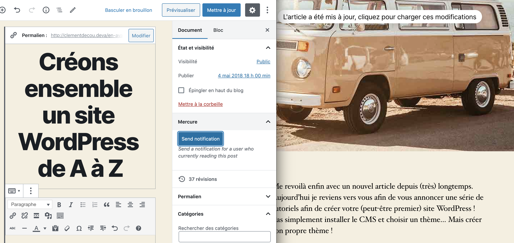

# WP Mercure
**WordPress integration of Mercure protocol.**

Source of the [WP Mercure plugin]() for WordPress.

## Install
- Install Mercure in your server and start it (see [Install section for Mercure](https://mercure.rocks/docs/hub/install))
- Search for "WP Mercure" under "Plugins → Add New" in your WordPress dashboard.
- Configure the plugin with the plugin admin menu

## Filters
### Disable live post for specific post
Use _wpmercure_allow_livepost_single_ filter to return true or false

### Use your custom notification style
Disable the default style of notification with the filter _wpmercure_include_notification_style_ and return false

## API
### Send message
Use WpMercure static function sendMessage.
`WpMercure::sendMessage('Topic', $message)`

### Listen to event
In your WordPress script use localize script to inject configuration into the script.

After that use EventSource to listen events

`const url = new URL(wpmercure.HUB_PUBLIC_URL);
url.searchParams.append('topic', yourTopic);
const eventSource = new EventSource(url);
 
eventSource.onmessage = e => {
  const data = JSON.parse(e.data);
  // do what you want
}`

## Screenshots

## Credits
- Use [Mercure](https://mercure.rocks/) protocol
Created by [Clément Décou](https://www.clement-decou.fr).
